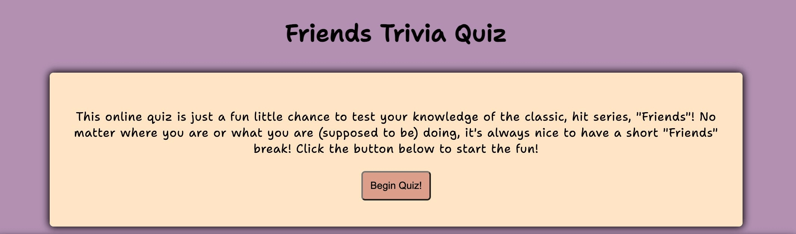

# Friends Trivia Quiz

The Friends Trivia Quiz exists to add a bit of fun to anyone's day! This quiz offers a way to pass time at work when things are slow, an alternative to a crossword while waiting for an appointment or just a fun test to see just how big of a Friends fan the user is!

This quiz will be targeted toward Friends enthusiasts and towards those who might be interested in what the TV series has to offer! The quiz will allow users to begin the quiz and find out their results when the questions run out.

## User Experience (UX)

- ### User Stories:
	- As a first-time user:
		- I want to be able to navigate easily to the quiz.
		- I want to be able to choose an answer to each question.
		- I want to be able to see my final score at the end of the quiz.
	
	- As a returning visitor:
		- I want to be able to navigate to the quiz.
		- I want to be able to choose an answer to each question.
		- I want to be able to see my final score at the end of the quiz.
		- I want to be able to share the quiz with my friends and followers after returning for more attempts to gain a perfect score.

    - As a frequest user:
        - I want to be able to navigate to the quiz.
		- I want to be able to choose an answer to each question.
		- I want to be able to see my final score at the end of the quiz.
		- I want to be able to share my quiz with friends and followers after returning for more attempts to gain a perfect score.
        - I want to be able to provide feedback to the quiz developers to share my experience with the quiz.

- ### Design:
	- Colour Scheme: The color scheme for this quiz was inspired by the main background setting of the Friends Television Series. The signature purple door with a gold frame.
	- Typography: Shantell Sans is the main font used throughout the quiz with Sans Serif being the fallback font, in case of any issues with the font being used on different browsers. Shantell Sans offers a relaxed, casual and fun vibe for the users experience.
	- Imagery: The images were chosen to enhance the users experience by offering fun visuals throughout the quiz. 

- ### Wireframe:
	

## Existing Features:

- Start page - Beginning of quiz:
	- The first page of the quiz provides the user with a description of what they can expect when entering this site. 
	- The "Begin Quiz" button is clearly visible to the user and marks the beginning of the quiz.

- Main page image:
	- The image on the main page was chosen to draw the users attention and allow for a connection to be made to the quiz from possible previous experiences with the hit series.

- Footer:
	- The footer exists on all pages to provide the user with social media links should they wish to share the fun of the quiz with friends and family.
	- The style remains consistent for the user's ease of navigating throughout the quiz.
	- The links will open in a new window to allow the user to continue navigating through the quiz without using the back button.
	

- Quiz page:
	- The quiz begins and offers easy navigation to the user and maintains consistent styling.
	- The Next button is disabled until an answer is chosen and, once and answer is chosen, only the Next button can be selected. The answer buttons only allow for one guess.
	- The answer turns green if the correct answer was chosen. This allows the correct score to increment so the user is aware of their score throughout the quiz.
	
	- The answer turns red if the incorrect answer was chosen. This allows the incorrect score to increment.
	

- Results page:
	- The quiz ends after 10 questions have been answered and provides the user with their final score, a brief message and a fun image!
	
	- Below this, a Feedback Form is provided to allow the user to send feedback of their experience with the quiz.
	

- 404 Error Page:
	- A 404 error page was created to provide a fun alternative page to the user should the URL not work. 
	- A link to the beginning of the quiz is provided for easy navigation to the correct site. 

### Future Features
- With more time, I would like to implement a score board to allow users to see their score compared to previous users. 

## Testing

Validator testing:
- JavaScript
	- The code was validated using JShint and no major issues were found.
- HTML
	- No errors were found when passing through the W3C Validator.
	
- CSS
	- No errors were found when passing through the W3C CSS Validator.

- The quiz app's accessibility was tested by using Lighthouse in DevTools. The quiz received high accessibility:

### Further Testing:
- All social media links were tested to ensure there were no breaks to hinder the usability of links. 
- All text input areas and feedback forms were tested to ensure forms are submitted correctly and require information from users.
- The quiz was tested by peers, friends, family and colleagues who provided feedback on any bugs or issues that needed to be fixed. A few minor grammatical errors were found.
- Testing and debugging occured in DevTools throughout the duration of the creation of this quiz.
- The quiz was tested on Google Chrome, Microsoft Edge, Safari and mobile phones to ensure the quiz's responsiveness and appearance remained consistent throughout each. 

### Manual Testing - added for resubmission:
While making the necessary adjustments needed for this resubmission, the following additional testing was carried out:
- The quiz was taken to consider the timer and checked to make sure the timer resets with each question shown
- Incorrect answers were chosen to ensure the correct message is displayed on the results page
- Correct answers were chosen to ensure the correct message is displayed on the results page
- The timer was allowed to run out of time to ensure the alert message showed and the incorrect score was incremented
- The link to the home page was tested from the quiz page and works to restart the quiz from scratch
- The link to the home page was tested from the results page and works to restart the quiz from scratch
- The form was tested and submitted and successfully works using the form dump to show the users input

### Bugs/Unfixed Bugs:
- The 404 page initially consisted of major scrolling issues as I did not have time to figure out how to fix this completely before the first submission. I have multiple commits to try adjusting the image size on the 404 page as the changes can only be seen in the deployed site of this quiz. 
- After pushing to GitHub multiple times to see the deployed version of this page, I was advised by tutor suppot that I could add /404.html to the end of my local server running the project to view the 404 page. 
- The 404 page now has no excess scrolling as I updated the viewport meta data, as I did in the index.html file. This solved all excess scrolling issues!

## Resubmission Feedback
To follow the assessment criteria for this project, I have made adjustments to my code to complete the requirements:
- (1.1) 
    - A restart button has been added to the final results page to allow the user to restart the quiz. This was not implemented for the first submission as I had run out of time and should have added this to the ReadMe. 
- (1.7)
    - I have added custom functionality of a countdown timer that restarts with each question throughout the quiz. This creates excitement and urgency to the user to choose an answer before the time is up.
    - The idea for this functionality came from [Stack Overflow](https://stackoverflow.com/questions/61807525/how-to-create-a-quiz-countdown-timer-for-each-question)
- (2.5)
    - I was able to fix the horizontal scrolling throughout the quiz and 404 page by updating the viewport meta data. The idea to research more about this came from other student issues reported on Slack. 
    - These sites were used to implement the "user-scalable" feature which removed all unecessary scrolling: [Sitebulb](https://sitebulb.com/hints/mobile-friendly/the-viewport-meta-tag-prevents-the-user-from-scaling/) and [MDN Web Docs](https://developer.mozilla.org/en-US/docs/Web/HTML/Viewport_meta_tag)
    - No more media queries were necessary following the above adjustment, as all screen sizes work as they should.
- (2.8)
    - A link has been added to the title so that the user can always navigate back to the home page and restart the quiz if needed. The cursor becomes a pointer to show the user this is an option. 
- (4.3/4.4)
    - For the first submission of this project, I was able to receive help from fellow students on Slack to acheive the functionality needed for the quiz and do not have other external resources to source throughout the code. 
    - I have redone the coding to make it my own and have refactored and restructured functions to ensure the single responsibility principle applies and to reduce repetitive or unnecessary code.
    - I would have liked to start over and redo this project from scratch, but with prior deadlines, this was not feasible, as I did not have enough time to create a brand new project.
    - I have also added customer functionality for a countdown timer and a link to the home page to show my knowledge of JavaScript. 
    - *** I have found the concepts within JavaScript are more manageable and understandable since working through Python ***
- Merit (1.3)
    - Although a Merit grade is not achievable at this stage, I did implement a countdown timer to add extra functionality to the quiz. 
    - With more time I would like to add a scoreboard at the end.
- Merit (2.1)
    - Fixed/Unfixed bugs noted in Readme - these should have been noted in the first submission. Unfortunately, time was against me. I have now added this section to this ReadMe. 

## Deployment

This quiz was deployed through GitHub Pages.
- Steps taken to deploy: 
	- In the GitHub repository, navigate to the “Settings” tab
	- Select “Pages”
	- Save branch ("main")
	- Reload page once updated
	- Click on deployed github-pages link in the right-hand side of the “Code” page.
	
The live link to this site can be found here: https://morganoleary.github.io/Friends-Trivia-Quiz/

### Fork Repository

Forking a repository allows you to create a copy to GitHub, and any changes made will not affect the original repository:
- Within GitHub, navigate to the repository page you are going to fork
- Click "Fork" on the top right corner of the page
- Wait for the copy to be created and you are then redirected to the forked repository

### Clone repository

Cloning a repository allows you to create a local copy of a repository on your machine:
- Within GitHub, navigate to the repository you are wanting to clone
- Click the green "<>Code" button
- Within the "Local" tab, copy the HTTPS url
- In your IDE, open Git Bash and type in 'git clone' followed by the pasted url just copied from GitHub. (git clone https://example.com/repository/project)
- The clone has been created on your local machine

## Credits

### Content: 
When needing assistance with the content of this project, I was able to receive great feedback and help from peers and Code Institute staff on the Slack platform. My understanding grew when I was able to speak with my mentor and tutor support. 

### Technologies Used:

- Languages Used: HTML, CSS, JavaScript
- Programs Used: Balsamiq, Google fonts, Font Awesome, Git, GitHub, Adobe Express, tinypng.com 

YouTube links that offered great examples of the JavaScript needed for this type of quiz:
- Build A Quiz App With JavaScript:  https://www.google.com/search?sca_esv=567993882&rlz=1C5CHFA_enUS893US893&tbm=vid&sxsrf=AM9HkKl5LhNI1TwYi1rbthDFRmg9nyFInQ:1695558462447&q=javascript+for+quiz+questions+and+answers&sa=X&ved=2ahUKEwj7jea-n8OBAxVBVUEAHdw5AQkQ8ccDegQINBAH&biw=1420&bih=721&dpr=2#fpstate=ive&vld=cid:956d4a1b,vid:riDzcEQbX6k,st:0
- How To Make Quiz App Using JavaScript 
	https://www.youtube.com/watch?v=PBcqGxrr9g8&t=1403s

A helpful step by step tutorial:
- https://simplestepscode.com/javascript-quiz-tutorial/

### Media & Layout:

- The quiz questions and answers were sourced from:
	https://ahaslides.com/blog/friends-quiz-questions/

- The photos appearing throughout this quiz were sourced from:
	https://wallpaperaccess.com/friends-tv-show

- The style of this quiz was created by myself, while I also created the content of the main start page and the results page. 

## Acknowledgements
I would like to leave a huge "Thank You" here to my mentor, Code Instute's tutoring staff and my peers on Slack. 